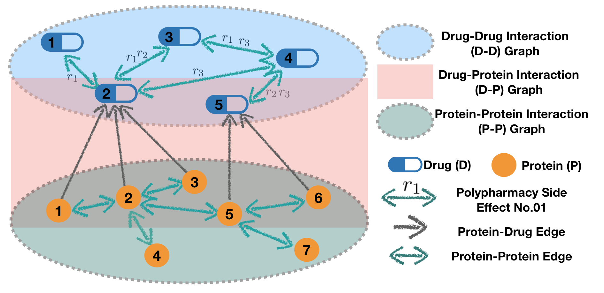
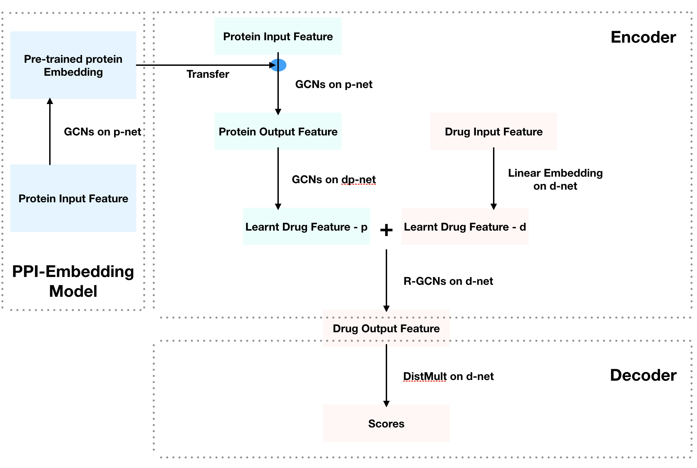

# FM-PSEP
Our hierarchical graph convolutional neural network model *FM-PSEP* is an **efficient** 
general approach for **multirelational link prediction** in any hierarchical 
heterogeneous network. 

Here, we are particularly concerned about the 
safety of [polypharmacy](https://en.wikipedia.org/wiki/Polypharmacy), which is 
the concurrent use of multiple medications by a patient. Given a pair of drug, 
the model will predict how many polypharmacy side effects the drug pair will 
have, and what are the possibilities.

Code implementations base on the [PyTorch-Geometric](https://github.com/rusty1s/pytorch_geometric) package, make sure it has been installed 
before running the code. 

## Data Drive

We construct a hierarchical heterogeneous graph of two node types: proteins and 
drugs. We think of the whole graph as three sub-graph.
- *p-net*: protein-protein association network
- *d-net*: drug-drug association network with multiple edge types (each edge 
type refers to a polypharmacy side effect)
- *pd-net*: drug-protein association network whose edges have the direction 
from protein node to drug node

## Performance Comparision

We will firstly evaluate three auto-encoder approach (Hamilton et al., 2017),
 and compare them with our approach:
- GAE (Kipf and Welling, 2016): [[paper]](https://arxiv.org/abs/1611.07308)
- AROPE (Zhang et al., 2018): [[paper]](https://dl.acm.org/citation.cfm?id=3219969),  [[code]](https://github.com/ZW-ZHANG/AROPE)
- LINE (Tang et al., 2015): [[paper]](https://arxiv.org/abs/1503.03578)

We firstly consider using DistMult (Yang et al., 2015[[paper]](https://arxiv.org/abs/1412.6575)) as decoder to predict the polypharmacy side effect of drug pairs.

Then, we will compare our model with the state-of-the-art polypharmacy side effect prediction models:
- DECAGON (Zitnik, 2018): [[paper]](https://arxiv.org/abs/1802.00543), [[code]](https://github.com/marinkaz/decagon)
- DeepDDI (Ryu et al., 2018): [[paper]](https://www.pnas.org/content/115/18/E4304), [[code]](https://bitbucket.org/kaistsystemsbiology/deepddi/src/master/)
- mvGAE (Ma et al., 2018): [[paper]](https://arxiv.org/abs/1804.10850), [[code]](https://github.com/matenure/mvGAE)
- MR-GNN (Xu et al., 2019): [[paper]](https://arxiv.org/abs/1905.09558), 
[[code]](https://github.com/prometheusXN/MR-GNN)

## Result by now

*All the models are trained on GPU. [torch-memlab](https://github.com/Stonesjtu/pytorch_memlab) helps to profile and inspect memory usage*

### Pre-train ppi embedding
2 layers GCN:
- 80 epochs([output](./out/ppp.pdf)): 
- around 92% auprc.
- less than 2GB GPU memory cost. 
- Time cost: 2 mins.

### Interaction prediction (use drug ids as feature, dd-net):
21st July - RGCN + DistMult:
- parameter dim: 16, 16, 16, 16
- around 64% auprc (Limited to the number of parameters, ).
- around 10GB GPU memory cost.
- Time cost: 10 mins.
- to improve: change batch => mini-batch, add more parameters, biased sampling.

5th Aug - RGCN + NN-1:
- output file: [[here]](out/16-16-8-8-16-963/16-16-8-8-16-963.pdf)
- parameter dim: {16, 16, 8, 8}, {16, 963}
- 100 epoch
- auprc:0.9317, auroc:0.9451, ap@50:0.9317, time/epoch:60s
- maximum GPU memory cost: 7.5G

8th Aug - RGCN + DistMult:
- output file: [[here]](out/dd-rgcn-dist/100ep.pdf)
- parameter dim: {16, 64, 32, 16}
- 100 epoch
- auprc:0.9479, auroc:0.9586, ap@50:0.9482, time/epoch:109s
- maximum GPU memory cost: 10.94G

- Evaluation (the top20 highest and lowest AUPRC)

8th Aug - RGCN + NN-1:
- output file: [[here]](out/dd-rgcn-nn/rgcn-nn-100ep.pdf)
- parameter dim: {16, 64, 32, 16}, {16, 963}
- 100 epoch
- auprc:0.9437, auroc:0.9542, ap@50:0.9438, time/epoch:s
- maximum GPU memory cost: 11.G

### Interaction prediction (use protein ids as feature):
7th Aug - HGCN + NN-1:
- output file: [[here]](out/pd-32-16-8-16-963/pd-nn-test.pdf)
- parameter dim: {32, 16, 8}, {16, 963}
- 100 epoch
- auprc:0.7461, auroc:0.7432, ap@50:0.7331, time/epoch:28s
- maximum GPU memory cost: 7.94G